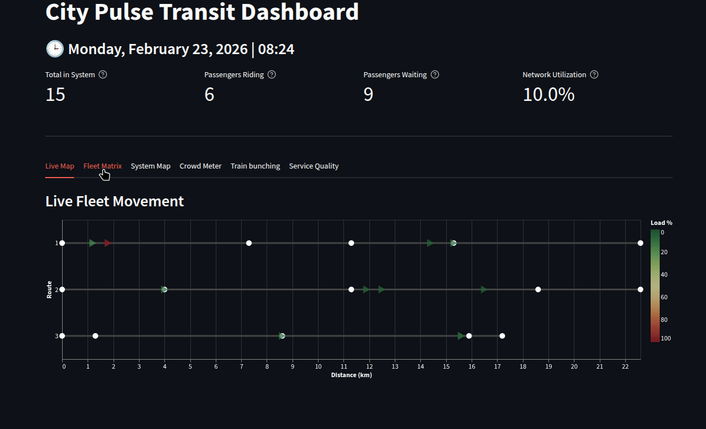

# CityPulseTransit


## Overview
CityPulseTransit is an end-to-end, event-driven data engineering pipeline and public transit simulation.

It models a live transit network, streaming real-time passenger and fleet telemetry through a distributed architecture to power a live analytical dashboard.

This project was built to demonstrate data engineering design patterns, specifically:
**streaming data capture, idempotent state recovery, dimensional modeling, and decoupled presentation layers.**

## Architecture & Tech

* **Producer / Simulator:** Python (Custom Object-Oriented Simulation)
* **Message Broker:** Apache Kafka & Zookeeper (Dockerized)
* **Data Warehouse:** PostgreSQL (Dockerized)
* **Transformation:** dbt (Data Build Tool)
* **Presentation:** Streamlit & Altair

## Key Engineering Goals Achieved

### 1. Single-Command CI/CD Emulator (`build.py`)
To ensure ease of use, this project is built by running a single script. Executing the python build script isolates the environment, installs dependencies, executes a pytest suite, provisions Docker containers, and runs dbt build, mimicking a clean CI/CD deployment pipeline.

### 2. Idempotent Disaster Recovery
If the analytical layer crashes, the data consumer can safely replay the entire Kafka retention window with minimal changes. By default, the simulation recovers from inturruption, and continues onward.

Architectural Note / Known Limitation: Halting the simulation mid-tick (e.g., via a hard SIGINT or Ctrl-C) can occasionally result in a split-brain state.

A passenger's internal route history can desync from the physical train location. 
This issue is likely fixed, but full testing is still needed, as of March 5, 2026. Will complete test March 6, 2026, and update.

For the scope of this demonstration, a clean initialization via the build script is recommended after a hard interruption.

### 3. Decoupled "Clean Slate" UI Architecture
The presentation layer (Streamlit) is strictly decoupled from the simulation and the message broker. By polling exclusively from dbt's materialized dimensional marts, it cleanly visualizes the live state of the simulation.

### 4. Metric Aggregation via dbt
Raw telemetry—such as average wait times, live train headways, and passenger movements—is streamed to Postgres and processed into mart-grade analytical views defined using dbt.

### 5. Finite State Machine Routing
The transit logic relies on static routing rules. Each entity (trains and passengers) utilizes a finite state machine to navigate the network correctly, including passengers coordinating transfers across multiple train routes.

### 6. Small Amounts Of Non Determinism
To simulate realistic telemetry, the system introduces controlled non-determinism. Passengers experience variable delays at stations due to traffic, and trains can be interleaved with fleets from other routes while maintaining strict ordering within their own routing groups. Fundamental behaviors remain fixed: passengers actively navigate between trains, and fleets continuously loop their assigned routes.

---


## Quickstart Guide
This project is designed to run on any local machine with Docker and Python 3.10+ installed.

### 1. Clone the repository
```
git clone (https://github.com/MarkTigchelaar/CityPulseTransit.git)

cd CityPulseTransit
```
### 2. Run build script
```
python build.py
```

### 3. Activate python venv

```
On Mac/Linux:
source .venv/bin/activate
```

```
On Windows:
.venv\Scripts\activate
```
### 4. Run the system
```
python run.py
```

### 5. Open dashboards, and data dictionary
in your browser, open any of the following to observe the architecture, or the dashboard of the system:

```
Live Dashboard: http://localhost:8501

dbt Data Dictionary: http://localhost:8081

Kafka Dashboard:   http://localhost:8080
```


### AI Pair Programming
In building CityPulseTransit, I utilized Gemini as an accelerator and architectural sounding board. 

While the core system design, domain logic, and data pipelines are my own, 
Gemini assisted in rapidly prototyping the Streamlit dashboard, debugging complex Python state-recovery issues, and scaffolding boilerplate. 

Using an LLM to discuss the trade-offs of various event-driven patterns allowed me to significantly compress the development and testing cycles while maintaining a high standard of correctness, despite the complexities of the system.